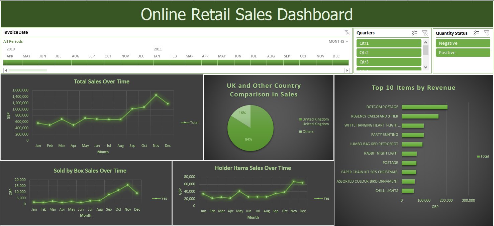

<h1 style="text-align: center;">Online Retail Analysis
</h1>  

### INTRODUCTION
Utilizing Microsoft Excel, an indispensable and frequently demanded skill for the Data Analyst role, I adeptly manage to clean and manipulate raw datasets while also creating interactive dashboards. However, due to the dataset's size of over half a million rows, I encounter lags and delays. Consequently, for enhanced efficiency when analyzing large volumes of data, it is preferable to utilize other tools for convenience. 

 

### DATA COLLECTION
For this project, I used the dataset from this source: [Online Retail Dataset](https://archive.ics.uci.edu/dataset/352/online+retail),  which contains all the transactions occurring between 12/1/2010 to 12/9/2011 from a company that mainly sells unique all-occasion gifts. The dataset is based in the United Kingdom and registered non-store online retail. The raw dataset has 541,909 instances, and 6 features. 
 

 
Raw Data

 

### DATA PREPARATION
The dataset is substantial, comprising over half a million rows, making it challenging to analyze. Initially, I copied the raw dataset, created a new sheet labeled 'Working Sheet,' and pasted it there. Within my Working Sheet, my first step was to check for duplicates in the raw data. By highlighting the relevant cells and navigating to the Data Tab, I successfully removed duplicates, resulting in the deletion of 5268 rows.
 

 
Removing Duplicates

 
After removing duplicates, my next step is to check for blank values using the Sort and Filter function. Upon filtering the description column, I noticed the presence of "?" values and blanks, prompting me to filter them out entirely. Upon further inspection, I discovered that all values in the price column were 0. Consequently, I made the decision to delete all rows containing such values for my analysis.
 
 

 
Values with "?" like, and Blanks

 
 
 

 
0 Price

 

### DATA MANIPULATION & ANALYSIS
The next step involves navigating to the Insert Tab, allowing me to create a table that includes data from all the necessary cells for further analysis.
 
 

 
Creating Table
 
 

Upon checking the feature quantity filter, I discovered that some entries have negative quantity values. However, upon analyzing, I realized that these negative numbers may represent items that were likely removed due to expiration or the end of a promotion. Therefore, I decided to retain these instances of negative quantity for further analysis.

 
Negative Quantity
 
 

There are 6 questions I will answer here:
1. How is our overall revenue performance to date?
2. What is the revenue performance of items sold as box sets?
3. What is the revenue performance of items sold as individual pieces (holder items)?
4. How many purchases originate from outside the UK?
5. Can we identify any instances of revenue loss?
6. What are the top 10 items by description in terms of revenue?
 

To address this, I must add six features to my Working Sheet, namely: Year, Month, Holder Item, Sold by Box, Quantity Status, and Revenue.

I will extract the Year and Month from the InvoiceDate feature using the TEXT function. The Holder Item feature will have 'Yes' or 'No' values, determined by this formula: "=IF(IFERROR(SEARCH("holder",C2), "not holder") = "not holder", "No", "Yes")". This formula searches for words similar to 'holder' within each Description value. If it finds the word 'holder', it returns 'Yes'; otherwise, it returns 'No' [Reference: SEARCH FUNCTION](https://www.ablebits.com/office-addins-blog/excel-find-search-functions/#:~:text=The%20FIND%20function%20in%20Excel,substring%20within%20a%20text%20string.&text=The%20first%202%20arguments%20are,string%20to%20be%20searched%20within). The same logic applies to the Sold by Box feature.

For the Quantity Status feature, cells will display either 'Positive' or 'Negative' based on this formula: =IF([@Quantity]<0, "Negative", IF([@Quantity]>0,"Positive")).

I've added these features to enable us to assess revenue losses by using them as filters in our dashboard. Additionally, we can evaluate the total revenue with no loss. We can also identify the bottom 10 items by Description that have negative total revenue.

The Revenue feature is simply the product of the Quantity and UnitPrice features. 
 

 
Added Features
 
 
### DATA VISUALIZATION 
In these steps, I will create some pivot tables and an interactive dashboard. This process is inspired by a YouTuber named Mo Chen. You can watch the video by clicking the image below.
 

 
      

 

### PIVOT TABLE
I will first create two sheets, namely: Pivot Table and Dashboard. In the Pivot Table sheet, I will proceed to create a pivot table by clicking on the Insert Tab, then selecting the PivotTable icon. Next, I will select all the cells in my Working Sheet.

To address the first question, I will choose 'Month' for Rows and 'Sum of Revenue' for Values from the PivotTable Field. Following this, I will insert a line chart, rename all axes, and customize the number category. It is evident from the graph that there is seasonality, with November showing consistently high trends, reaching a peak of $1.45 million in total revenue.
 

 
Pivot Table and Chart for Renue
 
 

To address the second question, I will duplicate the previous pivot table. Then, in the PivotTable Fields, I will select 'Sold by Box' and drag it into the Columns section. Following this, I will continue to use a Line Chart with the same design, including renamed axis and the same number category as the previous pivot chart I created. It is clearly evident that the peak performance of items sold in boxes remains in November, reaching $15.77K, indicating ongoing seasonal trends.
 

 
Pivot Table and Chart for Sold by Box Item
 

 
 
To tackle the third question, I will duplicate the pivot table containing the sold-by-box items. Then, in the PivotTable Fields, I will replace the 'Sold by Box' feature with 'Holder Item'. I will proceed by applying the same steps used in the previous Line Chart. As anticipated, it exhibits seasonal trends, with its highest peak occurring in November, totaling $64.14K.
 

 
Pivot Table and Chart for Holder Item
 

 
 
To address question number four, I will use a Pie Chart to illustrate the comparison between sales in the UK and those in other countries. First, I will duplicate the pivot table. Then, I will deselect all previously chosen fields in the PivotTable Fields and select the 'Country' field for rows and the 'Revenue' field for values. The calculation for the value field will remain set to sum.
 
 
As the Pie Chart visualizes the data, it becomes evident that the UK accounts for 84% of total revenue sales. To simplify the visualization, I will group all other countries into a single category named "Others." I will then apply the same theme used for the Line Chart and provide it with an appropriate title. The Pie Chart will demonstrate that only 16% of total revenue originates from outside of the UK.
 

 
Pivot Table and Chart for Country
 

 
 
To address question number 5, we will utilize the first pivot table we created. In the PivotTable Fields, I will add the 'Quantity Status' to filters, enabling us to examine all instances with negative revenue. Upon observation, we note a peak of declining trends in December, resulting in an approximate revenue loss of $0.28 million.
 

 
Negative Revenue
 

 
 
Question number 6 can be addressed using a bar chart arranged in descending order based on the Description feature's total Revenue for each unique Description value. To achieve this, I will duplicate a pivot table on my pivot table sheet, deselect all fields, and add the Description field to Rows and 'Sum of Revenue' to Values. Next, in the pivot table, I'll right-click, navigate to Filter, and select Top 10. In the Top 10 Filter box, I'll choose 'top', '10', 'items', and 'Sum of Revenue'. This will display the top Item Descriptions with the highest total revenue. We observe that our top-performing item, based on revenue, is 'DOTCOM POSTAGE', generating over $0.206 million in total revenue.
 

 
Top 10 Items
 

 

### DASHBOARD
In this section, I will be constructing the dashboard. The initial step involves navigating to my Dashboard sheet. In column A, I adjust the width to 1, and for row 1, I set the height to 5. Then, I merge some cells and fill them with a green color, labeling it as 'Online Retail Sales Dashboard'. Below are the steps I followed to create the dashboard:

1. I duplicate the line chart titled 'Total Sales Over Time' from the pivot table sheet and paste it into my dashboard sheet. Following this, I insert Timelines by selecting the copied line chart and accessing the Insert tab. I then choose 'Invoice Date' and style it with a green color, positioning it in the top left corner. 

2. I resize and rearrange the chart to ensure it fits appropriately within the dashboard.

3. Slicers are added to facilitate visualization based on the questions we initially posed. Specifically, I include slicers for Quarter to analyze quarterly performance and Quantity Status to assess revenue performance with or without negative revenue. I arrange these elements and remove gridlines for a cleaner appearance.

4. I ensure that all slicers are connected to all charts, enabling interactive filtering across the dashboard. This is accomplished by right-clicking on each slicer, navigating to 'Report Connection', and ensuring that all pivot tables are selected.

 

Here's a brief video showcasing the interactive dashboard I've built using MS Excel. Simply click on the cat image to view it.
 

 
      

 

### CONCLUSION
Despite the dataset covering only a one-year timeline, noticeable seasonality in revenue persists. However, there is a discernible upward trend in revenue over time. Additionally, with nearly 20% of buyers originating from outside the UK within this timeframe, it is evident that this online retail store is attracting a diverse customer base. These trends suggest that the store should continue its efforts to maintain and improve its performance.

The summary of Online Retail analysis:
- I analyzed revenue trends by month using a line chart. November stood out with a peak revenue of $1.45 million, indicating seasonality.
- I examined revenue trends for items sold as boxes, finding that November remained the peak month with $15.77K in revenue.
- I investigated revenue trends for holder items, observing a seasonal peak in November with $64.14K in revenue.
- A pie chart compared UK sales to other countries, revealing that the UK accounted for 84% of total revenue. Only 16% of revenue originated from outside the UK.
- I explored instances of negative revenue using a pivot table, identifying a peak loss of approximately $0.28 million in December.
- A bar chart displayed the top revenue-generating item descriptions, with 'DOTCOM POSTAGE' leading at over $0.206 million in total revenue.

Thank you for reviewing the data analysis. Have a pleasant day!
